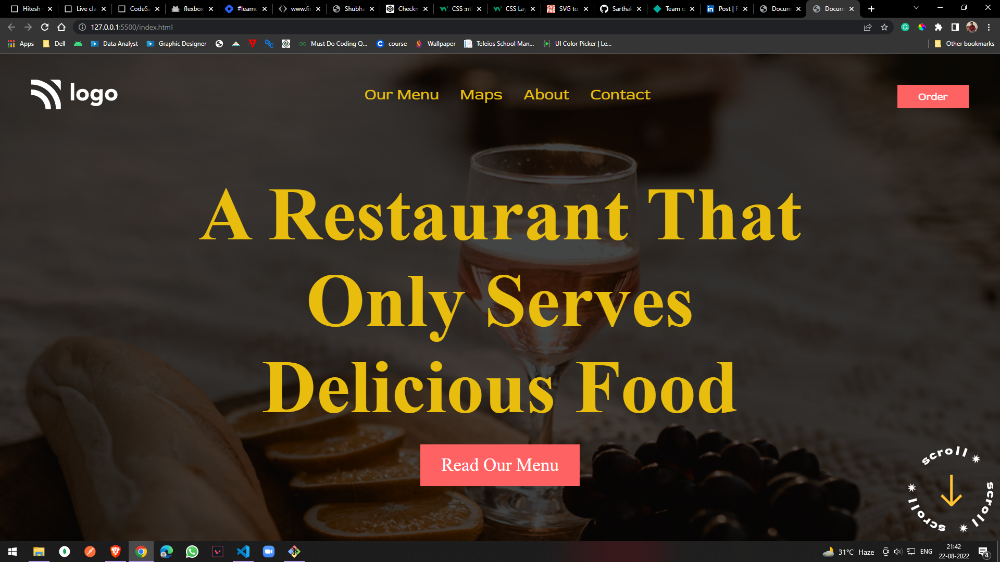

# Food Restaurant Home Page
This is a demo project work of a webpaga for a restaurant. Technologies used to built this project are HTML and CSS.It is a beginner frendly project. [Live Link](https://sarthaklive-project02.netlify.app/)
## Technologies I Learn during this Project
  - HTML5
  - CSS3
## Topics I Learn during this Project
 - Syntax of CSS
 - Positions in HTML and CSS
### Thumbnail of the project

### Images of the project
 